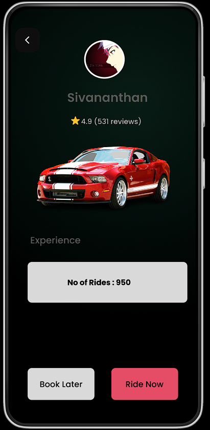

Team Name : Techtitans_Dhaanish  

Team Members:  
1. M Sivananthan  
2. S Shyam  
3. v.Swetha  
4. R.Ramya  

[View Live Demo](https://www.figma.com/proto/RUYRjYq7oWMMn8n3Fx1ype/RIDEEASY?node-id=19-2135&node-type=FRAME&t=WMF8HgXR9bJY92NI-1&scaling=scale-down&content-scaling=fixed&page-id=1%3A2&starting-point-node-id=19%3A2135&show-proto-sidebar=1)

I'll delovep deeper into specific areas, such as technical implementation, user onboarding, and detailed feature descriptions.

---

# RideShare Application

## Overview
The **RideShare Application** is an AI-powered platform tailored for Hexaware employees, designed to optimize commuting through carpooling. The application connects employees with similar routes and schedules, aiming to reduce travel costs, build a sense of community, and promote sustainability within Hexaware.

## Objectives
- **Cost Efficiency**: Lower daily commuting expenses by sharing fuel and vehicle maintenance costs.
- **Community Building**: Enhance workplace relationships by facilitating shared commutes.
- **Sustainability**: Contribute to reduced carbon emissions and traffic congestion, aligning with Hexaware’s environmental goals.
- **Safety & Convenience**: Provide a secure, user-friendly platform with features like real-time tracking and AI-based ride matching.

## Scope
The application serves Hexaware employees across all locations, supporting both intra-city and inter-city carpooling. It seamlessly integrates with Hexaware’s IT systems, ensuring easy onboarding and user management.

## Key Features

### User Authentication
Employees log in using their corporate credentials, ensuring that only verified Hexaware employees can access the platform. This security measure maintains the integrity of the ride-sharing ecosystem.

### AI-Powered Ride Matching
The application leverages AI algorithms to match riders and drivers based on multiple factors:
- **Route Similarity**: Ensures that ride partners share common travel paths.
- **Travel Schedules**: Matches users with overlapping commute times.
- **User Preferences**: Considers user preferences such as car type, seating arrangement, and other comfort factors.

### Flexible Ride Scheduling
The application supports both pre-scheduled rides and on-demand ride matching:
- **Advance Booking**: Users can plan their rides ahead of time, ensuring availability.
- **On-Demand Matching**: For spontaneous trips, users can quickly find available rides based on their immediate needs.

### Cashless Transactions
Payments are managed within the app, with features like:
- **Automated Fare Calculation**: The fare is calculated based on distance and split among participants.
- **Secure Payment Processing**: Transactions are conducted securely within the app, eliminating the need for cash exchanges.

### Real-Time Tracking
Safety and convenience are enhanced through real-time tracking:
- **Live Ride Monitoring**: Riders and drivers can track the ride in progress, ensuring timely updates and peace of mind.
- **Arrival Alerts**: Notifications are sent when the driver is en route or has arrived at the pick-up location.

## User Roles

### Riders
Riders are Hexaware employees seeking to carpool to and from work. Their role involves:
- **Searching for Rides**: Finding rides that match their route and schedule.
- **Requesting Rides**: Sending requests to available drivers.
- **Commuting**: Sharing the ride with the driver and other riders.
- **Providing Feedback**: Rating the ride experience for future improvements.

### Drivers
Drivers are Hexaware employees offering rides. Their responsibilities include:
- **Posting Rides**: Entering ride details, including route, schedule, and available seats.
- **Reviewing Requests**: Accepting or declining ride requests based on compatibility.
- **Commuting**: Providing a safe and comfortable ride for the participants.
- **Receiving Payments**: Automatically receiving payments after the ride, facilitated by the app.

### Administrators
Administrators oversee the entire system, ensuring smooth operation:
- **User Management**: Managing accounts and verifying employee credentials.
- **Ride Monitoring**: Overseeing ride activities to ensure compliance with policies.
- **Reporting**: Generating reports for management to review the application’s performance.
- **Issue Resolution**: Addressing any disputes or issues that arise.

## Process Flow

### Rider Process
1. **Log In**: The rider logs in using corporate credentials.
2. **Search for Rides**: The rider searches for available rides that match their route and schedule.
3. **Request Ride**: The rider sends a ride request to a suitable driver.
4. **Confirm Ride**: Once the driver accepts, the ride is confirmed.
5. **Commute**: The rider shares the commute with the driver and other passengers.
6. **Provide Feedback**: After the ride, the rider provides feedback on the experience.

### Driver Process
1. **Log In**: The driver logs in and posts a ride, detailing the route and available seats.
2. **Review Requests**: The driver reviews and accepts ride requests from riders.
3. **Coordinate Ride**: The driver coordinates with riders for pick-up and drop-off.
4. **Commute**: The driver completes the ride, ensuring safety and comfort.
5. **Receive Payment**: Payment is processed automatically through the app.
6. **Provide Feedback**: The driver can also provide feedback on the ride experience.

### Administrator Process
1. **Log In**: The administrator logs in to access the backend system.
2. **Manage Users**: The administrator handles user accounts, ensuring only verified employees can use the app.
3. **Monitor Rides**: The administrator monitors ongoing rides to ensure they comply with company policies.
4. **Generate Reports**: Detailed reports are generated to track usage, cost savings, and environmental impact.
5. **Resolve Issues**: The administrator addresses any disputes or technical issues that arise.

## AI Algorithms

### Ride Matching Algorithm
This algorithm intelligently pairs riders and drivers by analyzing:
- **Destination Matching**: Ensuring the rider and driver are headed in the same direction.
- **Time Preferences**: Matching users with similar schedules for seamless coordination.
- **Historical Data**: Learning from past ride data to improve matching accuracy over time.

### Route Optimization Algorithm
Designed to minimize travel time and distance, this algorithm:
- **Optimizes Multi-Stop Routes**: Adjusts routes to efficiently accommodate multiple riders.
- **Reduces Travel Time**: Ensures the most efficient route is selected, reducing delays.

### Payment Calculation Algorithm
The app automatically calculates and splits the fare among riders:
- **Distance-Based Calculation**: Each rider pays proportionally based on the distance traveled.

### Notification Algorithm
This algorithm handles all ride-related notifications, ensuring users are always informed:
- **Ride Status Updates**: Notifies users of key ride milestones (e.g., driver en route, arrival).
- **Payment Alerts**: Sends alerts for fare calculation, payment confirmation, and receipts.
- **Reminders**: Provides reminders for upcoming rides and alerts for cancellations.

### Feedback Analysis Algorithm
User feedback is crucial for continuous improvement. This algorithm:
- **Aggregates Feedback**: Collects and analyzes feedback from riders and drivers.
- **Identifies Trends**: Spots recurring issues or praise points to guide app enhancements.
- **Improves User Experience**: Uses insights from feedback to refine features and algorithms.

## Future Enhancements

### Public Transport Integration
Plans to integrate with local public transport systems to offer hybrid commuting options, combining the convenience of carpooling with public transit.

### Expanded Access
Consider extending the application to external partners or neighboring businesses, fostering a broader community network.

### AI Improvements
Continuous refinement of AI algorithms to enhance ride matching, route optimization, and overall user satisfaction.

### Gamification
Introducing a rewards system where users earn points or badges for frequent use, eco-friendly commuting, and positive feedback, incentivizing sustainable commuting practices.

## Stakeholders

### Primary Stakeholders
- **Hexaware Employees**: The main users of the application, including both riders and drivers.
- **IT and Support Teams**: Responsible for maintaining the app’s infrastructure and addressing technical issues.

### Secondary Stakeholders
- **Hexaware Management**: Oversees the application's alignment with corporate goals and its overall success.
- **HR Department**: Utilizes the app to support employee well-being and sustainability initiatives.

## Conclusion
The RideShare Application is a key initiative in Hexaware’s strategy to enhance employee commuting experiences while supporting sustainability. Its AI-driven features ensure a secure, efficient, and user-friendly platform, benefiting both employees and the environment. As the application evolves, it will continue to integrate new features and expand its reach, further solidifying Hexaware’s commitment to innovation and corporate social responsibility.

---

This expanded content maintains clarity and efficiency while adding more depth, ensuring the document covers all necessary aspects across six pages.
